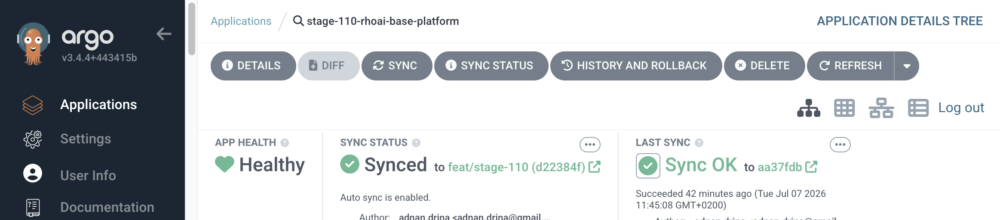
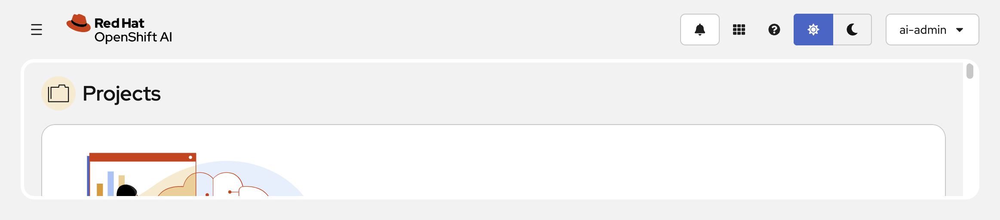
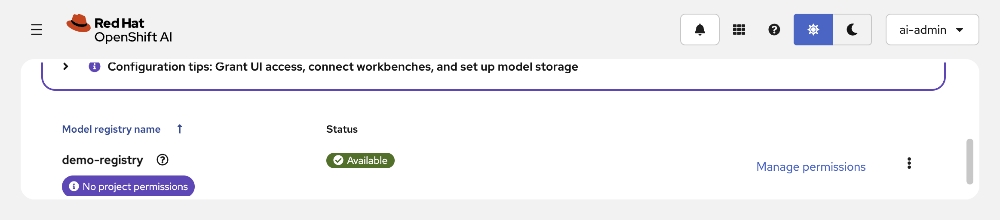

# Stage 110: RHOAI Base Platform

## Why

Every enterprise AI platform needs a governed, repeatable foundation. GitOps
ensures that platform state is declarative, auditable, and recoverable. Red Hat
OpenShift AI provides the managed AI/ML platform layer on top of OpenShift.

## What

- **OpenShift GitOps** (ArgoCD) bootstrap for declarative platform management
- **OpenShift Data Foundation** MCG for S3-compatible object storage
- **Red Hat OpenShift AI** operator, DataScienceCluster, and DSCInitialization
- **Model Registry** for centralized model artifact management
- **Demo access** configuration for admin and developer personas

## Architecture

This stage establishes the foundation that all subsequent stages build upon:

```text
OpenShift Cluster
├── openshift-gitops (ArgoCD)
│   └── stage-110-rhoai-base-platform Application
│       ├── ODF operator (stable-4.20) + standalone MCG StorageCluster
│       ├── RHOAI operator (stable-3.4)
│       ├── DSCInitialization + DataScienceCluster
│       └── Model Registry (demo-registry)
├── openshift-storage (ODF MCG — S3-compatible object storage)
├── redhat-ods-operator (RHOAI control plane)
├── rhoai-model-registries (demo-registry + MySQL backend)
└── demo-sandbox (workload namespace)
```

`deploy.sh` bootstraps the one layer ArgoCD cannot manage for itself: the
OpenShift GitOps operator, the ArgoCD instance (`resourceTrackingMethod:
annotation`), the `rhoai-nvidia-demo` AppProject, and the controller
cluster-admin binding. Everything else is delivered by the ArgoCD Application
syncing `gitops/stage-110-rhoai-base-platform/` from Git.

## What It Looks Like

Once deployed, the stage delivers a healthy GitOps-managed foundation with all
operators reconciled and instance CRs ready.

### ArgoCD Application

The single `stage-110-rhoai-base-platform` Application manages all platform
resources from Git. Auto-sync is enabled; any drift is self-healed.



### Red Hat OpenShift AI Dashboard

The RHOAI Dashboard is accessible to demo users (`ai-admin`, `ai-developer`,
`ai-researcher`) via the htpasswd identity provider configured by
`setup-access.sh`.



### Model Registry

The `demo-registry` Model Registry instance is backed by an in-cluster MySQL
database and reports Available status in the RHOAI Dashboard settings.



## Official Documentation

- [Installing OpenShift AI Self-Managed](https://docs.redhat.com/en/documentation/red_hat_openshift_ai_self-managed/3.4/html/installing_and_uninstalling_openshift_ai_self-managed)
- [OpenShift GitOps](https://docs.redhat.com/en/documentation/openshift_container_platform/4.20/html/gitops/index)
- [ODF 4.20](https://docs.redhat.com/en/documentation/red_hat_openshift_data_foundation/4.20/)

## Prerequisites

- OpenShift Container Platform 4.20 cluster
- Cluster admin access
