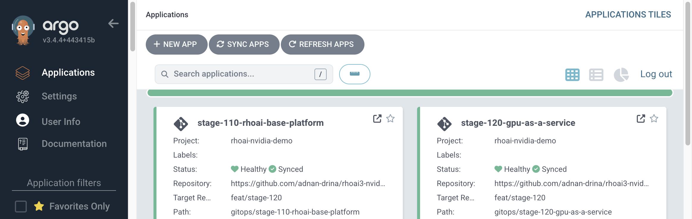
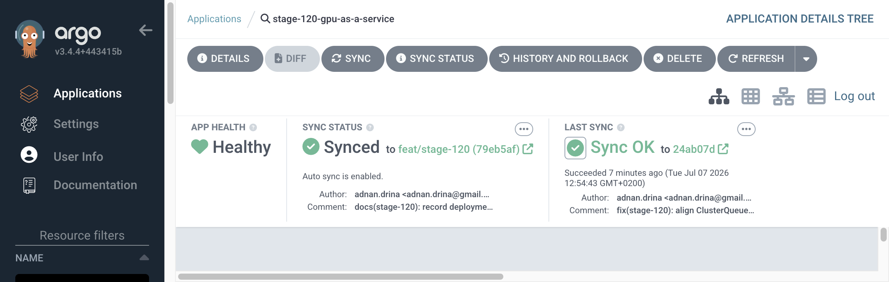
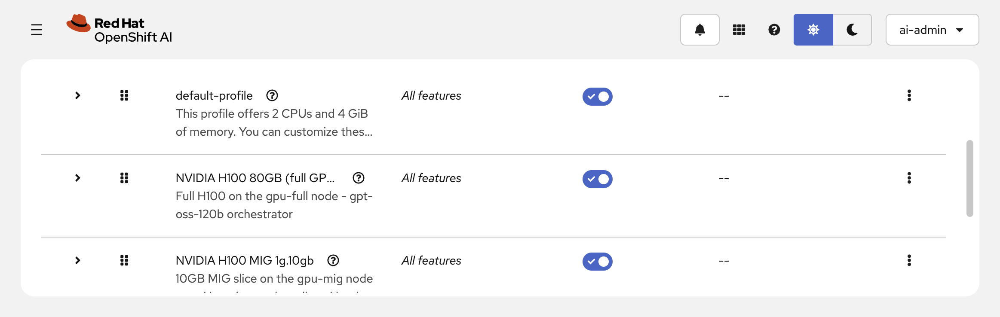
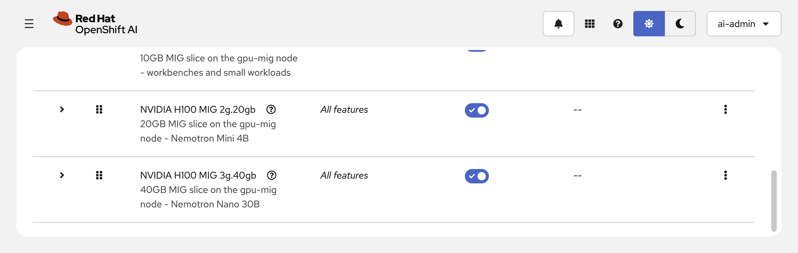

# Stage 120: GPU as a Service

## Why

Multi-agent research workflows require GPU-accelerated inference for large
language models. Enterprise GPU management needs fair scheduling, quota
enforcement, and hardware abstraction so multiple teams can share GPU resources.
MIG (Multi-Instance GPU) lets a single H100 serve multiple models concurrently,
maximizing utilization without cross-tenant interference.

## What

- **GPU worker MachineSets** — two `p5.4xlarge` nodes (`gpu-full` and `gpu-mig`)
  with per-node labels for MIG configuration selection
- **Node Feature Discovery** (NFD) for hardware label detection
- **NVIDIA GPU Operator** (v26.3) with `mig.strategy: mixed` — MIG Manager
  applies `all-disabled` on `gpu-full` and `all-balanced` on `gpu-mig` via
  `nvidia.com/mig.config` node labels
- **Red Hat build of Kueue** (v1.3) for GPU-aware workload scheduling and quota
  management — ClusterQueue covering full-GPU + three MIG slice resource types,
  LocalQueue in `demo-sandbox`
- **Hardware Profiles** — `h100-full`, `mig-3g-40gb`, `mig-2g-20gb`,
  `mig-1g-10gb`, each with queue-based scheduling through the LocalQueue

## Architecture

```text
OpenShift Cluster
├── gpu-full Node (p5.4xlarge / NVIDIA H100 80GB)
│   ├── NFD labels
│   ├── GPU Operator drivers (mig.config: all-disabled)
│   └── nvidia.com/gpu: 1  (full device)
├── gpu-mig Node (p5.4xlarge / NVIDIA H100 80GB)
│   ├── NFD labels
│   ├── GPU Operator drivers (mig.config: all-balanced)
│   └── MIG slices: 1×3g.40gb + 1×2g.20gb + 1×1g.10gb
├── Kueue
│   ├── ClusterQueue "default" (gpu + MIG quotas)
│   └── LocalQueue "default" (demo-sandbox, opted in)
├── Hardware Profiles
│   ├── h100-full        → nvidia.com/gpu
│   ├── mig-3g-40gb      → nvidia.com/mig-3g.40gb
│   ├── mig-2g-20gb      → nvidia.com/mig-2g.20gb
│   └── mig-1g-10gb      → nvidia.com/mig-1g.10gb
└── DSC Kueue: Unmanaged (CoP component patch)
```

## Deployment Model

- `deploy.sh` generates the two GPU MachineSets from the live worker
  template (cluster-specific infra ID, AMI, and subnet) and creates the
  ArgoCD Application pointing at `gitops/stage-120-gpu-as-a-service/`.
  MachineSets are script-managed infrastructure, not ArgoCD-managed.
- Everything else is delivered by the ArgoCD Application: NFD and GPU
  Operator subscriptions, ClusterPolicy, Kueue operator + CR, ClusterQueue,
  LocalQueue, and the four hardware profiles.
- DSC Kueue enablement uses a Composition-of-Patches (CoP) component in the
  stage-110 RHOAI instance overlay — `Unmanaged` with the default queue
  names, since `Managed` is rejected at runtime in RHOAI 3.4.

## Deployed State

Once fully deployed, the stage adds GPU-as-a-Service capabilities on top of
the stage-110 foundation. GPU-dependent acceptance criteria (driver
installation, MIG partitioning, allocatable resources) activate automatically
when GPU nodes join the cluster.

### ArgoCD Applications — Both Stages Synced & Healthy

Both `stage-110-rhoai-base-platform` and `stage-120-gpu-as-a-service`
Applications are synced from Git with auto-sync enabled.



### ArgoCD Stage 120 Detail

The `stage-120-gpu-as-a-service` Application manages NFD, GPU Operator,
Kueue, ClusterQueue, LocalQueue, and all four hardware profiles.



### Hardware Profiles in RHOAI Dashboard

Platform users see GPU hardware profiles alongside the default CPU profile.
Each GPU profile maps to a specific resource type and routes workloads through
the Kueue LocalQueue for quota-governed scheduling.





## Official Documentation

- [Working with accelerators](https://docs.redhat.com/en/documentation/red_hat_openshift_ai_self-managed/3.4/html/working_with_accelerators)
- [AI workloads](https://docs.redhat.com/en/documentation/openshift_container_platform/4.20/html/ai_workloads/index)
- [NVIDIA GPU Operator](https://docs.nvidia.com/datacenter/cloud-native/gpu-operator/)
- [Kueue](https://docs.redhat.com/en/documentation/red_hat_build_of_kueue/1.3)

## Prerequisites

- Stage 110 deployed and validated
